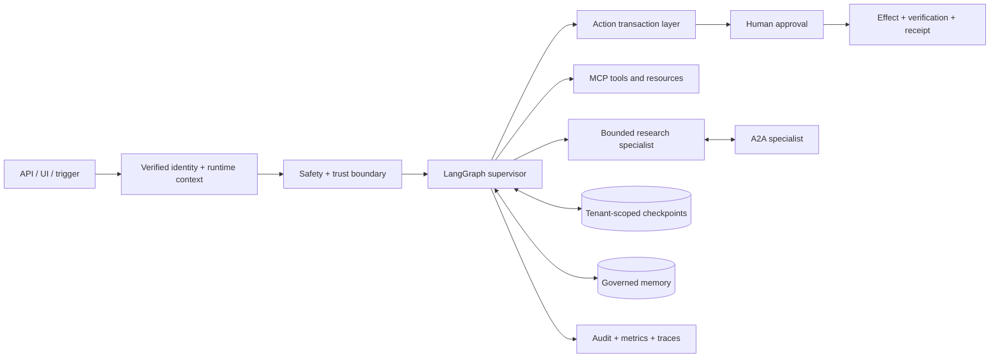

# Kompass

Kompass is a production-oriented reference architecture for a bounded support and operations
agent. It combines LangGraph orchestration, deterministic authorization, human approval,
transactional action execution, governed memory, official MCP and A2A SDKs, and offline
agent evaluation. The included ACME systems are synthetic local adapters, not production
integrations.

## Architecture



Identity and authorization are application controls. Model output, user input, retrieved
documents, MCP output, A2A output, and memory are not authorization sources. Write effects
are re-authorized after approval, deduplicated by an idempotency key, verified against
business state, and recorded as receipts.

## Production-oriented core

- A single-agent default and a supervisor mode with one read-only research specialist.
- Request-scoped clock, locale, identity, tenant, scopes, request ID, and correlation ID.
- Deny-by-default tool policy and explicit capability limits independent of prompts.
- Provenance-tagged trust boundaries for user, document, tool, MCP, A2A, and memory content.
- Durable LangGraph HITL checkpoints: SQLite for the smallest setup or PostgreSQL 17 in Compose.
- Action transaction layer with approval state, idempotency, deadlines, bounded retry,
  effect verification, compensation hooks, and structured audit events.
- Official MCP 2.x client/server over stdio or Streamable HTTP, including resources and scopes.
- Official A2A SDK 1.0 card, JSON-RPC/HTTP interfaces, streaming task lifecycle, cancellation,
  bearer-auth adapter, concurrency limits, and tenant task isolation.
- Tenant/user-scoped semantic, episodic, and procedural memory with TTL, deletion, provenance,
  confidence, poisoning checks, and a review queue for distilled lessons.
- Bounded research planning, parallel gathering, normalization, deduplication, provenance,
  contradiction exposure, evidence indexing, deadlines, and source/query budgets.
- Deterministic offline evaluations separated from optional LLM-as-judge/full-model runs.
- Vendor-neutral metrics/audit ports plus optional Langfuse tracing. Raw content export is off
  by default.
- Reproducible release metadata in `agent_release.json`.

## Experimental / learning modules

These remain useful demonstrations but are not imported by the production agent assembly:

- `kompass/graph/debate.py`: multi-agent debate/judge panel.
- `kompass/retrieval/cag.py` and `graphrag.py`: alternative retrieval experiments.
- `kompass/ingest/multimodal.py`: multimodal extraction demonstration.
- `spike_frameworks/`: PydanticAI comparison and historical parity results.
- `kompass/sandbox/`: allowlisted analysis sandbox; suitable for local demonstrations, not a
  hardened hostile-code isolation boundary.

## Capability status

| Capability | Status | Boundary |
|---|---|---|
| Runtime context, trust policy, local authorization engine | IMPLEMENTED | Local mode is development-only; Compose uses real Keycloak OIDC |
| HITL and transactional actions | IMPLEMENTED | ACME effect adapter is a deterministic local system |
| MCP stdio and Streamable HTTP | IMPLEMENTED | Production OAuth issuer/resource configuration required remotely |
| A2A 1.0 lifecycle and auth hook | IMPLEMENTED | Distributed task persistence and production token verification require infrastructure |
| Tenant memory, cache, checkpoints, receipts | IMPLEMENTED | PostgreSQL receipt/thread tables use forced RLS; ACME business data is a single-tenant fixture |
| PostgreSQL checkpoint path | IMPLEMENTED LOCALLY | PostgreSQL 17 + official saver + migrations and integration tests in Compose |
| OIDC ingress | IMPLEMENTED LOCALLY | Keycloak 26.7 discovery, JWKS, signature, issuer, audience, expiry and tenant/scopes |
| Bounded research and evaluation V2 | IMPLEMENTED | Offline gate plus reviewed five-category Ollama baseline |
| Langfuse observability | REQUIRES EXTERNAL INFRA | Local no-op and vendor-neutral boundaries work without it |
| Debate, CAG, GraphRAG, multimodal, framework spike | EXPERIMENTAL | Excluded from production assembly |
| Local RLS, idempotency and reconciliation | IMPLEMENTED | Forced tenant RLS, atomic claims, target unique keys and repeatable CLI repair |

## Quickstart

Python 3.11+ is required.

```bash
python -m venv .venv
# Windows: .venv\Scripts\python -m pip install -r requirements-dev.txt
# POSIX:   .venv/bin/python -m pip install -r requirements-dev.txt

cp .env.example .env
python -m kompass.scripts.seed
python -m kompass.scripts.demo
```

Kompass defaults to Ollama at `http://localhost:11434`. Set
`KOMPASS_LLM_PROVIDER=openai` and an uncommitted `OPENAI_API_KEY` to use OpenAI. Start the
API with `python -m uvicorn kompass.api.app:app --port 8000` or the UI with
`python -m streamlit run ui/app.py`.

`KOMPASS_AUTH_MODE=local` trusts request identity fields and is development-only. Setting it
to `oidc` activates discovery/JWKS validation and requires issuer/audience configuration.

### Complete zero-cost local stack

Docker Compose starts exactly three services: the app, PostgreSQL 17, and Keycloak 26.7. All
images and credentials are local development fixtures; no cloud account, card, or subscription is
used.

```bash
docker compose up -d --build
curl http://localhost:8000/health
```

Keycloak is available at `http://localhost:8081` and imports two isolated test users (`alice` in
`tenant-a`, `bob` in `tenant-b`). The obvious passwords in `infra/keycloak/kompass-realm.json` are
local fixtures only. PostgreSQL is bound to `127.0.0.1:55432`; app traffic uses the non-superuser
`kompass_app`, while the local checkpointer setup uses the migration/admin connection.

Side-effect receipts use PostgreSQL when `KOMPASS_DATABASE_URL` is set. The action key is bound to a
canonical payload hash and atomically claimed before execution. The same key reaches the ACME target
database, whose unique constraints prevent a duplicate after timeout/commit ambiguity. Repair stale
receipts with:

```bash
docker compose exec app python -m kompass.scripts.reconcile --tenant tenant-a
```

## Validation and evaluations

```bash
python -m ruff check .
python -m pytest -q
python -m evals.offline --ci
python -m kompass.release
python -m pip_audit -r requirements-production.txt --progress-spinner off
```

The deterministic suite, offline gate, and release check make no paid LLM calls. With the Compose
services running, `make test-integration` proves real OIDC, PostgreSQL checkpoints, tenant RLS,
administrative access, and concurrent idempotency. `make load-test` records a bounded local load
report. The reviewed live baseline uses the installed local Ollama model:

```bash
make test-integration
make load-test
make evals-live-baseline
```

<!-- EVAL:START -->
| Metric (n=5) | Naive RAG baseline | Kompass | Delta |
|---|---:|---:|---:|
| Task success | 40% | **80%** | +40pp |
| Answer correctness (LLM judge) | 100% | **100%** | +0pp |
| Hallucination rate | 0% | **0%** | 0pp |
| Tool selection | 0% | **100%** | +100pp |
| Tool arguments correct | 0% | **100%** | +100pp |
| Retrieval relevance | 80% | **100%** | +20pp |
| P95 latency | 23.015s | 128.484s | - |
<!-- EVAL:END -->

## Local boundary

The checked-in Compose configuration is intentionally a local development/test environment: HTTP,
obvious fixture passwords, Keycloak development mode, one process, and local volumes. It is not a
public deployment configuration. The synthetic ACME business database represents one organization;
tenant RLS applies to runtime receipts and workflow ownership, not to that fixture's domain rows.
No cloud infrastructure is required or described by this repository.

See [enterprise runtime](docs/enterprise_runtime.md), [threat model](docs/threat_model.md),
[implementation ledger](docs/enterprise_agent_runtime_plan.md), and the existing deep dives in
[`docs/`](docs/).

## Repository map

```text
kompass/               runtime package
  actions/             authorization-to-effect transaction boundary
  a2a/                 official A2A card, client, server, lifecycle
  graph/               agent assembly, bounded worker, critic, budgets
  mcp_servers/         official MCP tool/resource servers
  memory/              governed user memory and reviewed lessons
  research/            bounded research workflow
  security/            audit, identity/authorization, trust middleware
evals/                 golden, judge, red-team, and deterministic offline evals
tests/                 unit, contract, security, and deterministic integration tests
spike_frameworks/      explicitly experimental framework comparison
```

## License

MIT.
