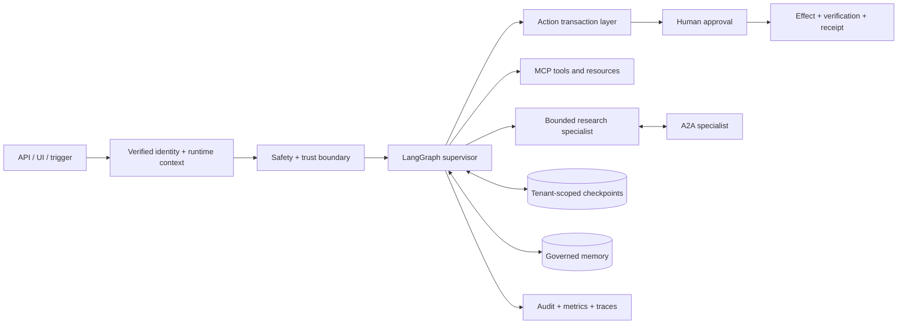

# Kompass

Kompass is a production-oriented reference architecture for a bounded support and operations
agent. It combines LangGraph orchestration, deterministic authorization, human approval,
transactional action execution, governed memory, official MCP and A2A SDKs, and offline
agent evaluation. The included ACME systems are synthetic local adapters, not production
integrations.

## Architecture



Identity and authorization are application controls. Model output, user input, retrieved
documents, MCP output, A2A output, and memory are not authorization sources. Write effects
are re-authorized after approval, deduplicated by an idempotency key, verified against
business state, and recorded as receipts.

## Production-oriented core

- A single-agent default and a supervisor mode with one read-only research specialist.
- Request-scoped clock, locale, identity, tenant, scopes, request ID, and correlation ID.
- Deny-by-default tool policy and explicit capability limits independent of prompts.
- Provenance-tagged trust boundaries for user, document, tool, MCP, A2A, and memory content.
- Durable LangGraph HITL checkpoints: SQLite locally; optional PostgreSQL adapter for deployment.
- Action transaction layer with approval state, idempotency, deadlines, bounded retry,
  effect verification, compensation hooks, and structured audit events.
- Official MCP 2.x client/server over stdio or Streamable HTTP, including resources and scopes.
- Official A2A SDK 1.0 card, JSON-RPC/HTTP interfaces, streaming task lifecycle, cancellation,
  bearer-auth adapter, concurrency limits, and tenant task isolation.
- Tenant/user-scoped semantic, episodic, and procedural memory with TTL, deletion, provenance,
  confidence, poisoning checks, and a review queue for distilled lessons.
- Bounded research planning, parallel gathering, normalization, deduplication, provenance,
  contradiction exposure, evidence indexing, deadlines, and source/query budgets.
- Deterministic offline evaluations separated from optional LLM-as-judge/full-model runs.
- Vendor-neutral metrics/audit ports plus optional Langfuse tracing. Raw content export is off
  by default.
- Reproducible release metadata in `agent_release.json`.

## Experimental / learning modules

These remain useful demonstrations but are not imported by the production agent assembly:

- `kompass/graph/debate.py`: multi-agent debate/judge panel.
- `kompass/retrieval/cag.py` and `graphrag.py`: alternative retrieval experiments.
- `kompass/ingest/multimodal.py`: multimodal extraction demonstration.
- `spike_frameworks/`: PydanticAI comparison and historical parity results.
- `kompass/sandbox/`: allowlisted analysis sandbox; suitable for local demonstrations, not a
  hardened hostile-code isolation boundary.

## Capability status

| Capability | Status | Boundary |
|---|---|---|
| Runtime context, trust policy, local authorization engine | IMPLEMENTED | OIDC claims must be verified by deployment ingress |
| HITL and transactional actions | IMPLEMENTED | ACME effect adapter is a deterministic local system |
| MCP stdio and Streamable HTTP | IMPLEMENTED | Production OAuth issuer/resource configuration required remotely |
| A2A 1.0 lifecycle and auth hook | IMPLEMENTED | Distributed task persistence and production token verification require infrastructure |
| Tenant memory, cache, checkpoints, receipts | IMPLEMENTED | ACME source database is a single-tenant fixture |
| PostgreSQL checkpoint path | REQUIRES EXTERNAL INFRA | Optional package, database, migrations, TLS, backup/restore |
| Bounded research and offline eval V2 | IMPLEMENTED | Public-web/live-model evaluation remains opt-in |
| Langfuse observability | REQUIRES EXTERNAL INFRA | Local no-op and vendor-neutral boundaries work without it |
| Debate, CAG, GraphRAG, multimodal, framework spike | EXPERIMENTAL | Excluded from production assembly |
| Production OIDC, secrets, TLS/DNS, database RLS | REQUIRES EXTERNAL INFRA | Fail-closed placeholders only |

## Quickstart

Python 3.11+ is required.

```bash
python -m venv .venv
# Windows: .venv\Scripts\python -m pip install -r requirements-dev.txt
# POSIX:   .venv/bin/python -m pip install -r requirements-dev.txt

cp .env.example .env
python -m kompass.scripts.seed
python -m kompass.scripts.demo
```

Kompass defaults to Ollama at `http://localhost:11434`. Set
`KOMPASS_LLM_PROVIDER=openai` and an uncommitted `OPENAI_API_KEY` to use OpenAI. Start the
API with `python -m uvicorn kompass.api.app:app --port 8000` or the UI with
`python -m streamlit run ui/app.py`.

`KOMPASS_AUTH_MODE=local` trusts request identity fields and is development-only. Setting it
to `oidc` fails closed until a verified-claims ingress adapter is configured.

## Validation and evaluations

```bash
python -m ruff check .
python -m pytest -q
python -m evals.offline --ci
python -m kompass.release
```

The first three commands are deterministic and make no LLM or public-network calls. The full
60-case evaluation uses configured models and an LLM judge, is opt-in, and can incur cost:

```bash
python -m evals.run --ci
```

<!-- EVAL:START -->
No Evaluation V2 live-model result is committed by this implementation. Run the complete
opt-in command above to establish a reviewed baseline; CI always runs the deterministic smoke gate.
<!-- EVAL:END -->

## Deployment boundaries

The local stack is deliberately useful without Docker. A real deployment still needs an OIDC
provider or verified identity-aware gateway, managed PostgreSQL, application-specific tenant
enforcement/RLS, a secret manager, TLS/DNS, backup/restore, and a telemetry backend. Install
`requirements-production.txt`, set
`KOMPASS_CHECKPOINT_POSTGRES_DSN`, and start once with migration privileges so the official
checkpointer can run `setup()`.

See [enterprise runtime](docs/enterprise_runtime.md), [threat model](docs/threat_model.md),
[implementation ledger](docs/enterprise_agent_runtime_plan.md), and the existing deep dives in
[`docs/`](docs/).

## Repository map

```text
kompass/               runtime package
  actions/             authorization-to-effect transaction boundary
  a2a/                 official A2A card, client, server, lifecycle
  graph/               agent assembly, bounded worker, critic, budgets
  mcp_servers/         official MCP tool/resource servers
  memory/              governed user memory and reviewed lessons
  research/            bounded research workflow
  security/            audit, identity/authorization, trust middleware
evals/                 golden, judge, red-team, and deterministic offline evals
tests/                 unit, contract, security, and deterministic integration tests
spike_frameworks/      explicitly experimental framework comparison
```

## License

MIT.
